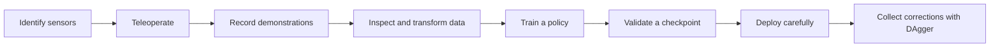

# What the project can do

> **Page scope:** Use this page to decide which project capability, CLI, and container fit your goal. For copyable procedures, go to [Workflows](workflows.md).

This page explains each capability in terms of the problem it solves. If terms such as *policy*, *episode*, or *checkpoint* are unfamiliar, begin with [Concepts for first-time users](concepts.md).

## The whole workflow



The project provides commands around each stage. The commands do not all need to be used for every experiment.

## Diagnose the environment

`lerobot-ros-doctor` checks the packaged runtime, configuration, declared devices, and optionally the ROS graph. Use it to distinguish an environment or wiring problem from a learning problem.

```bash
docker compose run --rm tools
```

This is the appropriate first capability because it does not intentionally command robot motion.

## Probe cameras

`lerobot-ros-probe-cameras` helps identify available camera inputs and verify that the configured device corresponds to the intended physical view. This should happen before collecting a dataset, because changing the camera identity or orientation later changes what the policy sees.

Camera probing is especially relevant on systems with several USB cameras or unstable numeric device names. See [Why probe cameras?](concepts.md#why-probe-cameras) before using the command.

## Record demonstrations

`lerobot-ros-record` records the observations and actions associated with human-controlled task attempts. The result is training data, not a trained controller.

Recording is useful when you need the policy to imitate behavior specific to your robot, cameras, task, and workspace. A useful recording session requires consistent sensor configuration and clear episode boundaries, not merely a large number of files.

## Preview and understand datasets

The preview and visualization commands let you inspect episodes before training. Use them to answer practical questions:

- Is each camera showing the intended view?
- Are images upright and synchronized with the attempt?
- Do actions change when the operator moves the robot?
- Does each episode contain one coherent task attempt?
- Are long inactive or invalid sections present?

Inspection comes before transformation. Otherwise, it is easy to apply a technically valid operation to the wrong problem.

## Transform datasets

The repository includes separate commands for downsampling, canonicalization, reorientation, trimming, cutting, episode renumbering, subtask repair, and action-source or plateau annotation.

These capabilities exist because training expects consistent semantics, timing, shapes, orientation, and metadata. They should produce a derived dataset while the source is retained for comparison.

Read [Why transform datasets?](concepts.md#why-transform-datasets) for the purpose and trade-off of each transformation.

## Train a policy

`lerobot-ros-train` uses a dataset to produce policy checkpoints. A policy is a learned mapping from observations to actions. Training does not prove that a checkpoint is safe or compatible with the live robot.

The repository supports the normal training path and includes two custom policy plugins:

- `strided_diffusion` uses observations spaced apart in time, giving a longer temporal view without adding an observation for every intervening frame;
- `action_history_diffusion` adds previous commanded actions to the policy input.

These are problem-specific choices, not a hierarchy of “basic” and “better.” See [Why use more than one observation frame?](concepts.md#why-use-more-than-one-observation-frame).

## Deploy a checkpoint

`lerobot-ros-deploy` loads a trained checkpoint, processes live observations, and produces commands for the robot interface. Deployment must begin with no-motion checks of observation names and shapes, action dimensions, normalization metadata, control frequency, and limits.

A checkpoint can load successfully and still be unsuitable for the current cameras, dataset convention, or robot configuration.

## Collect corrective data with DAgger

`lerobot-ros-dagger` collects data while a policy is being run and a person can provide interventions. `lerobot-ros-train-dagger` trains using the resulting action-source and DAgger metadata.

DAgger is useful when the current policy repeatedly reaches situations that ordinary demonstrations did not cover. It is not the default first step and it does not replace careful initial demonstrations. See [DAgger: collect corrections where the policy struggles](concepts.md#dagger-collect-corrections-where-the-policy-struggles).

## Back up and share datasets

`lerobot-ros-backup` supports preserving datasets outside the working copy. Backups matter because datasets are experimental inputs with provenance, not disposable build products. Keep a local copy until the destination has been checked, and keep authentication outside committed files.

## Visualize results

`lerobot-ros-app` and the preview commands help inspect recorded or processed data. Visualization is a validity check: it can reveal swapped cameras, orientation errors, inactive intervals, incorrect task boundaries, or unexpected annotations before those problems reach training.

## Which container should I use?

| Service | Purpose |
|---|---|
| `tools` | diagnostics, camera and dataset utilities, previews, backup |
| `robot` | hardware diagnostics, recording, deployment, DAgger |
| `gpu` | policy training |
| `dev` | tests, linting, and source development |

## Recommended reading order

1. [Concepts for first-time users](concepts.md)
2. [Your first run](first-run.md)
3. [Hardware and safety](hardware-and-safety.md)
4. [Workflows](workflows.md)
5. [Configuration](configuration.md)
