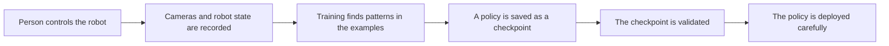
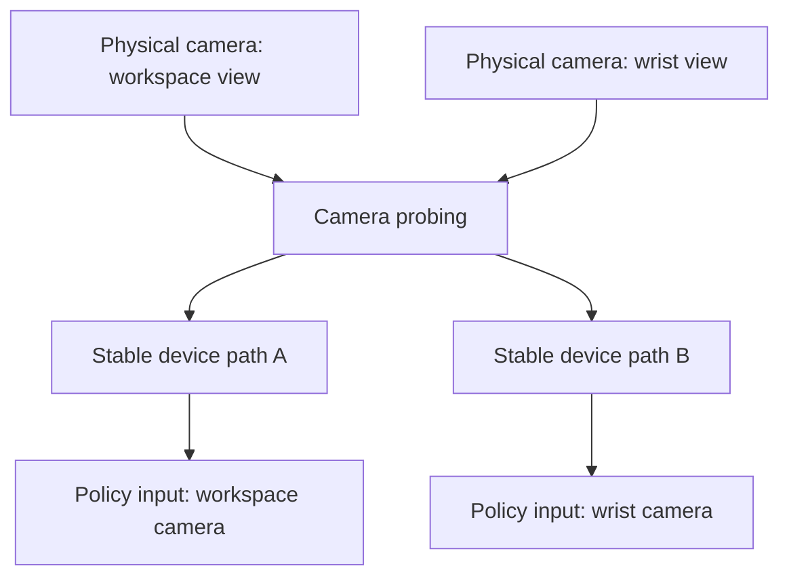
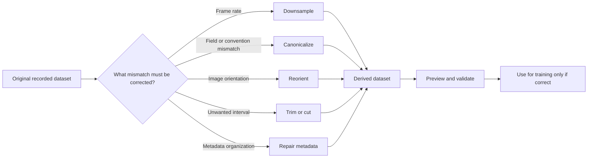
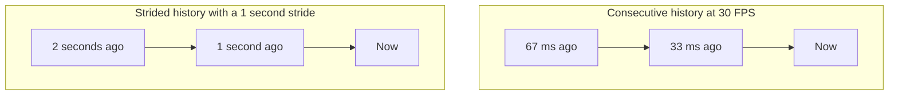
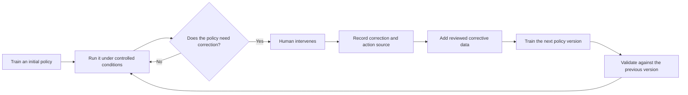

# Concepts for first-time robot-learning users

This page explains the ideas behind the commands. It assumes no robotics or machine-learning background.

## Start with one simple example

Imagine that the task is **pick up a block and place it in a tray**.

The following terms name the pieces of that process.

## Observation: what the robot can currently sense

An **observation** is the information given to the learning system at one moment. In this project it can include camera images and robot state.

A single observation may not completely describe what is happening. One image may not reveal whether an object is moving, whether the gripper has just closed, or how the robot arrived at its current pose. This is why some policies use a short history instead of only the latest frame.

## Action: what the system asks the robot to do

An **action** is a command produced for the robot. Its exact meaning depends on the configured robot interface.

An action is not guaranteed physical motion. Controllers, limits, communication, and the mechanism itself affect what actually happens. Recorded state, commanded actions, and safety checks therefore have different roles.

## Demonstration, episode, and dataset

A **demonstration** is an example performed by a person. An **episode** is one recorded attempt, with a beginning and an end. A **dataset** is a collection of episodes.

Each recorded moment associates observations with the action taken at that moment. Training uses many such examples to learn how a person tended to act in similar situations.

More data is not automatically better. Failed attempts, inconsistent camera views, incorrect timing, long inactive sections, or incompatible action conventions can teach the wrong relationship. Dataset inspection and transformation are therefore part of the learning workflow, not merely file maintenance.

## Policy: the learned decision maker

A **policy** is the model that maps observations to actions. Informally, it answers:

> Given what I can see and sense now, what command should I produce next?

During **training**, the policy is adjusted using recorded demonstrations. During **deployment**, the trained policy receives live observations and produces live commands.

A policy is not a scripted list of movements. It learns statistical patterns from the dataset. It can fail when the live situation differs from the demonstrations, when sensors are configured differently, or when the checkpoint and robot interface disagree.

## Checkpoint: a saved trained policy

A **checkpoint** is a saved state of the policy produced during training. Different checkpoints from the same training run can behave differently. A checkpoint should remain associated with the dataset, configuration, code version, and normalization metadata used to create it.

## Teleoperation, inference, and deployment

**Teleoperation** means that a person controls the robot through another input device or interface. It is used to create demonstrations and, in DAgger workflows, to intervene when the policy needs correction.

**Inference** means running a trained policy to obtain actions. **Deployment** connects inference to live observations and the robot-command interface.

Deployment is where a software prediction may become physical motion. Loading a checkpoint successfully does not prove that its cameras, observation shapes, action dimensions, frequency, or normalization match the current system.

## Why probe cameras?

Linux camera numbering can change, and several connected cameras may look similar to software. **Camera probing** helps determine which physical camera corresponds to each device path and configured input.

This matters because a policy does not understand a label such as “left camera” in the human sense. It learns from the image stream connected to that input during training. If deployment supplies a different camera, a mirrored view, a rotated image, or a different resolution, the policy receives a different kind of observation.

Probe cameras before recording when cameras were installed or moved, USB connections changed, device paths changed after reboot, two cameras may have been exchanged, or image orientation, resolution, or frame rate is uncertain.

Probing is a configuration check. It is not camera calibration, and it does not make different viewpoints interchangeable.

## Why transform datasets?

A **dataset transformation** creates a revised representation for a specific purpose. The safe mental model is “derive and inspect a new dataset,” not “clean up the original in place.”

### Downsampling

Downsampling reduces the temporal sampling rate. It can help when the source contains more frames than the intended training rate needs or when datasets must use a consistent rate.

The trade-off is lost temporal detail. Fast contacts or short actions can disappear if the rate is reduced too far. Policy settings that depend on dataset FPS must agree with the transformed dataset.

### Canonicalization

Canonicalization converts data to the project’s expected conventions and representation. The goal is consistency: the same semantic quantity should use the same field, order, shape, and convention across episodes or source datasets.

This is not harmless formatting. A wrong mapping can produce a dataset that loads successfully while assigning the wrong meaning to a value.

### Reorientation

Reorientation changes image orientation so recorded views are upright and consistent. It is useful when a camera is mounted upside down or source recordings use different orientations.

Training and deployment must use the same orientation convention. A rotated or mirrored deployment image changes the policy input.

### Trimming and cutting

Trimming removes unwanted material from the beginning or end of an episode. Cutting selects or separates a useful interval. Typical reasons include setup time, inactivity, or content outside the intended task attempt.

Do not trim merely to make every episode visually perfect. The result should still represent the situations the deployed policy needs to handle.

### Episode, subtask, action-source, and plateau metadata

Episode renumbering and subtask repair make dataset organization unambiguous and compatible with downstream tools. They do not improve behavior by themselves.

Action-source metadata records where commands came from, such as a policy or a human intervention. Plateau-related tools identify or visualize intervals according to the project’s plateau-processing logic. These annotations matter when training selects or weights particular parts of collected data.

Always preview and compare the derived dataset before training. Keep the source unchanged until the result has been validated.

## Why use more than one observation frame?

Two current images may look nearly identical even though the gripper is approaching the block in one case and moving away in the other. A history provides temporal context.

## Diffusion policy, in plain language

A **diffusion policy** generates a sequence of candidate robot actions through an iterative denoising process. For a first-time user, the important point is that it predicts an action sequence conditioned on observations. It does not look up a fixed motion script.

The custom variants in this repository encode different assumptions about which history is useful. They are not universally better than the simpler alternative.

## Strided diffusion: look farther back without using every frame

A normal consecutive history uses neighboring frames. `strided_diffusion` instead uses frames separated uniformly in time, allowing the same number of observation slots to cover a longer period.

Striding may help when a task depends on slower context, such as the phase of a manipulation or how the current pose was reached. It may be less appropriate when fast changes between adjacent frames are critical.

Important consequences:

- `policy.fps` must match the dataset FPS for this plugin;
- `stride_seconds` controls the temporal spacing;
- `n_obs_steps` controls how many spaced observations are used;
- unavailable history at the beginning of an episode is copy-padded by the implementation;
- deployment must reproduce the history convention used during training.

Choose striding because the task needs a longer view of the recent past, not merely because the option exists.

## Action-history diffusion: remember previous commands

`action_history_diffusion` conditions the policy on previous commanded actions as well as the current observations. This can provide information that is not fully visible in the current image and robot state.

It also creates a possible dependency: the policy may rely too strongly on previous commands. The plugin includes action-history dropout to reduce this dependence during training. Setting `n_action_history=0` removes the extra action-history conditioning and matches the stock diffusion-policy conditioning path described by the plugin documentation.

Use action history when previous commands are meaningfully informative for the task. Do not assume that adding it always improves performance.

## DAgger: collect corrections where the policy struggles

**DAgger** is an iterative data-collection workflow. Instead of collecting only demonstrations where a person acts from start to finish, it runs the current policy and captures human corrections around situations the policy actually encounters.

Why use it? A policy’s own mistakes can move the robot into states that are rare or absent in the original demonstrations. Corrections collected in those states can teach the next policy what to do there.

DAgger is not an automatic repair mechanism. Poor interventions, ambiguous action-source metadata, unsafe rollouts, or uncontrolled mixing of dataset versions can make the result worse. This repository therefore separates DAgger collection from DAgger training and supports sampling based on DAgger and action-source metadata.

## Training, validation, and deployment answer different questions

- **Training:** can the model fit useful relationships in the dataset?
- **Offline inspection:** are the data, outputs, and metadata internally consistent?
- **No-motion deployment checks:** does the checkpoint connect to the intended live inputs and outputs?
- **Controlled physical validation:** does behavior remain acceptable on the real system within defined limits?

A successful training run answers only the first question.

## A beginner’s decision path

1. Run the software-only doctor check.
2. Probe and identify cameras before recording.
3. Record a small, consistent dataset.
4. Preview episodes and verify observations, actions, timing, and task boundaries.
5. Transform data only when you can name the mismatch being corrected.
6. Start with the simplest policy that fits the task.
7. Use strided observations only when longer temporal context is relevant.
8. Use action history only when previous commands provide useful context.
9. Deploy first without motion, then use constrained physical checks.
10. Consider DAgger only after identifying recurring states where the policy needs corrective data.
