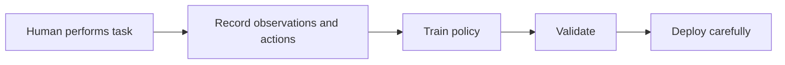

# LeRobot ROS 2

`lerobot_ros2` connects the main stages of a robot-learning experiment: identify sensors, control the robot, record examples, prepare datasets, train a policy, validate a checkpoint, deploy it, and collect corrective data.

!!! warning "Physical safety"
    This software can command real robots. It is not safety-rated and provides no real-time guarantee. Validate topics, services, limits, workspace clearance, emergency stops, and checkpoints without motion before enabling actuation.

## Recommended path

Follow this sequence if this is your first time in the repository:

1. [Concepts for first-time users](concepts.md) explains the terminology and learning loop.
2. [Installation](installation.md) establishes the supported host and container environment.
3. [Your first run](first-run.md) walks through one safe, software-only diagnostic.
4. [Choose a capability](capabilities.md) helps you select the right operation.
5. [Run a workflow](workflows.md) provides the command-oriented procedures.
6. [Hardware and safety](hardware-and-safety.md) is required reading before physical actuation.
7. [Configuration reference](configuration.md) documents local files, mounts, variables, devices, and secrets.

Contributors should continue with [Development](development.md) and [Release and validation](release-and-validation.md).

## Page responsibilities

- **Concepts** defines terms and explains why the major operations exist.
- **Installation** owns prerequisites, container images, build steps, and environment verification.
- **Your first run** is a linear tutorial. It links out instead of becoming a second reference manual.
- **Choose a capability** maps goals to tools and containers.
- **Run a workflow** owns operational commands.
- **Hardware and safety** owns controlled bring-up and acceptance checks.
- **Configuration reference** owns settings and local overrides.
- **Development** and **Release and validation** serve maintainers.

## The basic learning loop

A **policy** is the learned component that receives observations, such as images and robot state, and produces actions. It is trained from recorded examples. It is not a fixed script, and a completed training run is not evidence that deployment is safe.

## Supported release path

- Linux x86-64 with Docker Engine and Compose v2
- Optional NVIDIA Container Toolkit for GPU training and inference
- Stable `/dev/v4l/by-id` and `/dev/input/by-id` mappings for hardware
- Wheel-installed runtime images and a source-mounted development image

macOS, Windows, Docker Desktop USB forwarding, host ROS integration, and arbitrary camera firmware are best-effort and outside the supported contract.
