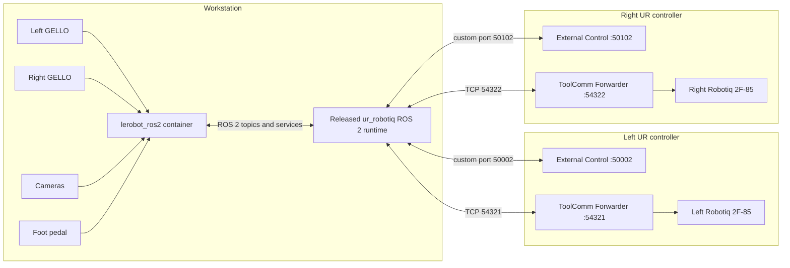

# Robot integration

## Choose your role

- **Operator on an already commissioned system:** do not change robot networking, ToolComm, calibration, launch files, or controllers. Copy the supported profile, confirm the released runtime version with the site integrator, and start at [Validate before enabling motion](#4-validate-before-enabling-motion).
- **Integrator commissioning the system:** complete the robot-side preparation, distinct-port setup, calibration review, and runtime launch under the site's robot-administration procedure.

If you do not know which role applies, stop before making robot-side changes and ask the person responsible for the robot deployment.

## Supported reference integration

The supported reference integration connects `lerobot_ros2` to the released ROS 2 Humble `ur_robotiq` runtime through the `ur_robotiq_bimanual` profile. It is the hardware configuration used to develop and validate this project:

- two UR3 manipulators;
- two Robotiq 2F-85 grippers;
- two GELLO devices;
- the cameras and foot pedal mapped in the local hardware overlay.

The robot code remains an external runtime dependency. Operators start the published image and use its public ROS interfaces. They do not edit the robot repository, installed Python files, launch files, or controller configuration as part of a normal `lerobot_ros2` workflow.

!!! note "Reference hardware and independence"
    This page documents the hardware used by the project and the integration that the project currently supports as its reference implementation. The project is not affiliated with, endorsed by, sponsored by, or officially connected with Universal Robots, Robotiq, Hugging Face, or the LeRobot project. Product and project names are used only to identify the hardware and upstream software with which this project interoperates.

!!! danger "Actuation boundary"
    The robot runtime can power robots, release brakes, start controllers, and publish commands. Complete [Hardware and safety](hardware-and-safety.md), keep both GELLO offset nodes in `control_mode=0` during checks, and follow the site's robot operating procedure.

Configurations derived from the generic templates are not supported reference integrations.

## System map

The reference integration spans the workstation and two robot controllers. The diagram shows ownership of the main processes and the distinct network paths; machine-local addresses and device identities remain outside the repository.

<div class="diagram-preview" markdown="1">



<button class="diagram-preview__open" type="button" popovertarget="diagram-popover-docs-robot-integration-md-1" aria-label="Enlarge diagram 1">
  <span aria-hidden="true">Enlarge</span>
</button>
</div>

<div id="diagram-popover-docs-robot-integration-md-1" class="diagram-popover" popover>
  <div class="diagram-popover__toolbar">
    <button class="diagram-popover__close" type="button" popovertarget="diagram-popover-docs-robot-integration-md-1" popovertargetaction="hide">Close</button>
  </div>
  <div class="diagram-popover__viewport" markdown="1">


  </div>
</div>

| Boundary | Configured in |
|---|---|
| ROS topics, services, recording semantics, and camera roles | `config.local/gello.yaml`, copied from the profile |
| Host camera, GELLO, and foot-pedal device mappings | `compose.hardware.yaml`, copied from the profile |
| Robot addresses, External Control ports, ToolComm ports, and controller setup | External released robot runtime and robot-side configuration |
| Dataset and output locations | Host directories mounted by `compose.yaml` |

!!! warning "Topology is not acceptance"
    The diagram does not establish hardware readiness. Keep both GELLO offset nodes in `control_mode=0` until the numbered integration checks are complete.

## What is committed

The profile separates reusable integration decisions from machine-local state:

| File | Purpose |
|---|---|
| `profiles/ur_robotiq_bimanual/gello.yaml` | Ready-to-copy `lerobot_ros2` topics, services, recording semantics, camera roles, and camera defaults. |
| `profiles/ur_robotiq_bimanual/compose.hardware.yaml` | Hardware overlay with explicit placeholders for host device identities. |
| `profiles/ur_robotiq_bimanual/compatibility.yaml` | Expected robot image, ROS distribution, and ROS interface contract. |
| `config/gello.example.yaml` | Generic annotated template for other robots and sites. |
| `config/compose.hardware.example.yaml` | Generic hardware-access template. |

Robot IP addresses, calibration files, physical device identifiers, GELLO serial identifiers, and site network details remain outside the committed profile.

## 1. Copy the supported profile

```bash
mkdir -p config.local data
cp profiles/ur_robotiq_bimanual/gello.yaml config.local/gello.yaml
cp profiles/ur_robotiq_bimanual/compose.hardware.yaml compose.hardware.yaml
```

Replace machine-local device placeholders, then check that none remain:

```bash
grep -R "REPLACE_" config.local/gello.yaml compose.hardware.yaml
```

The command must produce no output before hardware access.

Other robots and sites use the generic files under `config/` rather than this profile.

## 2. Prepare the robot hardware

> **Commissioning integrators only.** Operators of an already commissioned system skip this section.

The robot-side setup follows the same upstream procedures referenced by the `ur_robotiq` project. Complete them for both robots before starting the runtime:

1. [Install and configure UR External Control](https://docs.universal-robots.com/Universal_Robots_ROS2_Documentation/doc/ur_client_library/doc/setup/robot_setup.html).
2. [Configure robot networking](https://docs.universal-robots.com/Universal_Robots_ROS2_Documentation/doc/ur_client_library/doc/setup/network_setup.html).
3. [Install and configure the Universal Robots ToolComm Forwarder URCap](https://github.com/UniversalRobots/Universal_Robots_ToolComm_Forwarder_URCap) for gripper communication.

!!! caution "Use distinct ports"
    The two robots must not use the same External Control custom port. Both controller paths are exposed to the same workstation runtime, so each path needs an unambiguous endpoint. The launch example below uses `50002` for the left robot and `50102` for the right robot.

### Configure ToolComm for two grippers

With two Robotiq grippers, the two ToolComm Forwarder instances must also use distinct TCP ports. The reference launch uses `54321` for the left robot and `54322` for the right robot.

After installing ToolComm Forwarder, select one robot and open a shell session using the [UR shell-access procedure](https://docs.universal-robots.com/tutorials/urscript-tutorials/ssh.html). On that robot, verify the running ToolComm process and edit the ToolComm Forwarder daemon configuration:

```bash
# Verify the running process and its TCP port.
top -c

# Edit the ToolComm Forwarder daemon configuration.
nano /ursim/GUI/felix-cache/bundle185/data/com/fzi/rs485/impl/daemon/daemon-rs485.py
```

Change the `socat` TCP port from `54321` to `54322`, save the file, and reboot that robot. After rebooting, use `top -c` again to verify that the configured ToolComm process uses the intended port.

The path contains the URCap bundle identifier used by the documented `ur_robotiq` setup. If the installed ToolComm Forwarder version uses a different bundle directory, locate the installed daemon rather than assuming that `bundle185` is universal. Perform robot shell changes under the site's robot-administration procedure.

### Verify calibration and physical configuration

Before real-hardware launch, verify that the robot deployment has the intended:

- left and right UR calibration files;
- left and right robot base poses;
- left and right robot IP assignments;
- distinct External Control custom ports;
- distinct ToolComm TCP ports and local virtual serial device names.

Keep these machine-local values in the robot launch arguments and deployment configuration. Do not commit robot credentials, IP addresses, calibration files, or site details. The committed `lerobot_ros2` profile records the ROS interface contract, not the site's physical configuration.

## 3. Start the released robot runtime

Create the long-lived container once, or start the existing container. Use host networking for the ROS and robot network path, but do not grant blanket privileged access. Add only reviewed device mappings, groups, or Linux capabilities when the driver actually requires them:

```bash
docker start ur_robotiq || \
  docker run -dit \
    --net host \
    --name ur_robotiq \
    --entrypoint bash \
    ghcr.io/penzottimattia/ur_robotiq:gello
```

Launch the bimanual stack with the site-specific values. Keep the dashboard setup node disabled for the first real-hardware graph check because it can operate dashboard services, including power, brake, program-load, and play operations:

```bash
docker exec -it ur_robotiq bash -lc '  source /opt/ros/humble/ur_robotiq/setup.bash && \
  ros2 launch ur_robotiq control_bimanual_ur3_robotiq.launch.py \
    mode:=none \
    use_gello:=true \
    run_setup_node:=false \
    left_robot_ip:=<LEFT_ROBOT_IP> \
    right_robot_ip:=<RIGHT_ROBOT_IP> \
    left_custom_port:=50002 \
    right_custom_port:=50102 \
    left_tool_tcp_port:=54321 \
    right_tool_tcp_port:=54322'
```

Replace every placeholder and confirm that the selected ports match the teach-pendant and ToolComm configuration. Do not reuse example IP addresses from another installation.

To inspect the launch arguments exposed by the installed runtime:

```bash
docker exec -it ur_robotiq bash -lc '  source /opt/ros/humble/ur_robotiq/setup.bash && \
  ros2 launch ur_robotiq control_bimanual_ur3_robotiq.launch.py -s'
```

The runtime uses host networking. Set the same `ROS_DOMAIN_ID` for the robot runtime and `lerobot_ros2`. Keep the robot launch in its own terminal and do not add it to this repository's Compose project.

## 4. Validate before enabling motion

Follow the staged checks in [Hardware and safety](hardware-and-safety.md). At minimum:

1. validate the profile first with `mode:=full_mock`;
2. keep `run_setup_node:=false` during the first real-hardware graph inspection;
3. keep both GELLO offset nodes in `control_mode=0`;
4. inspect controller and hardware-component state;
5. verify left and right state and command paths independently;
6. confirm workspace clearance, limits, and emergency-stop access before enabling commands.

## 5. Verify the interface contract

Both runtimes must use the same `ROS_DOMAIN_ID` and host ROS network.

| Interface | Expected name |
|---|---|
| Left state | `/left_state_broadcaster/joint_states` |
| Right state | `/right_state_broadcaster/joint_states` |
| Left action | `/left_arm_controller/commands` |
| Right action | `/right_arm_controller/commands` |
| Left mode service | `/left_gello_offset_node/set_parameters` |
| Right mode service | `/right_gello_offset_node/set_parameters` |
| Left transition service | `/left_gello_offset_node/wait_for_mode_transition` |
| Right transition service | `/right_gello_offset_node/wait_for_mode_transition` |

Inspect the live graph before recording or deployment:

```bash
ros2 control list_controllers
ros2 control list_hardware_components
ros2 topic info /left_state_broadcaster/joint_states
ros2 topic info /right_state_broadcaster/joint_states
ros2 topic info /left_arm_controller/commands
ros2 topic info /right_arm_controller/commands
ros2 service type /left_gello_offset_node/set_parameters
ros2 service type /right_gello_offset_node/set_parameters
ros2 service type /left_gello_offset_node/wait_for_mode_transition
ros2 service type /right_gello_offset_node/wait_for_mode_transition
```

Then run the learning-side graph check:

```bash
docker compose -f compose.yaml -f compose.hardware.yaml run --rm robot \
  lerobot-ros-doctor --skip-hardware
```

Do not pass `--skip-ros-graph` for this integration check.

## 6. GELLO operating modes

The GELLO offset node supports four control modes:

- `0`: idle, with no command publishing;
- `1`: normal offset mode for teleoperation and recording;
- `2`: positive speed mode for one selected robot joint;
- `3`: negative speed mode for one selected robot joint.

Modes `2` and `3` provide sustained rotation of a selected joint. This can be useful for validated tasks that require repeated rotation, including screwing. They are specialized task modes, not diagnostic-only modes.

Their behavior is configured in the robot runtime:

- `speed_mode_joint_name`: joint to rotate; when empty, the last arm joint is used;
- `speed_trigger_joint_index`: GELLO joint used as the trigger; `-1` uses the last GELLO joint;
- `speed_max_velocity`: maximum angular speed in radians per second;
- `mode_transition_delay_seconds`: delay applied when entering or switching active modes.

The trigger scales motion from zero to `speed_max_velocity`. Mode `2` applies the positive direction and mode `3` the negative direction. Confirm the selected joint, trigger, direction, velocity, tool alignment, joint limits, workspace clearance, and emergency-stop access before entering either mode. Use a conservative site-approved velocity for the first controlled check.

Return the affected offset node to mode `0` before changing the selected joint, trigger, speed, tooling, controller, calibration, gripper, or topic settings. When returning to mode `1`, the node recomputes normal-mode offsets from the latest robot and GELLO states. Use the transition service exposed by the bimanual launch after changing modes.

!!! danger "Continuous single-joint motion"
    Modes `2` and `3` continue to advance the selected joint while the trigger is applied. An incorrect joint, direction, velocity, trigger, or tool alignment can produce unintended motion. Verify the selected joint and direction at conservative speed before using either mode for a task.

## 7. Continue to recording or deployment

After the interface check:

1. [Probe configured cameras](workflows.md#probe-configured-cameras).
2. [Record demonstrations](workflows.md#record-demonstrations).
3. [Visualize the dataset](workflows.md#visualize-a-dataset).
4. Confirm camera roles, image orientation, joint ordering, action dimensions, gripper convention, and `recording.hz` before training.
5. Repeat the same compatibility checks before deploying a checkpoint.

## Troubleshooting

The released `lerobot_ros2` image, released robot runtime, and `ur_robotiq_bimanual` compatibility profile are intended to be used together. If names, types, or commands differ, first check the released versions. Do not patch either running container to make incompatible interfaces appear to match.

### The robot runtime runs, but no robot state appears

**What this means:** a ROS topic is a named stream of messages. The two containers may be on different ROS domains, may not share the required host network, or the robot controllers may not be active and publishing state.

**Check in order:**

1. Confirm that both runtimes use the same `ROS_DOMAIN_ID`; this value selects which ROS processes can discover one another.
2. Confirm that both documented ROS paths use host networking.
3. Run `ros2 control list_controllers` and confirm with the site integrator that the required state broadcasters are active.
4. Compare the missing topic with `profiles/ur_robotiq_bimanual/compatibility.yaml`.

**Continue when:** the exact expected state topics are present and update with current values.

!!! danger "Do not proceed"
    Do not enable commands while required topics are absent, substituted with unfamiliar names, or publishing stale state.

### A service name or type differs from the profile

A ROS service is a named request-and-response interface. A similarly named service is not automatically equivalent.

**Fix:** confirm that the released robot image matches `compatibility.yaml`. If it does not, use the compatible released image. If it does but the interface still differs, stop and report the release/profile mismatch; do not add an unrecorded remapping.

!!! danger "Do not proceed"
    Do not call a service whose type or effect is not understood, especially dashboard services that can power, release brakes, load programs, or start execution.

### Moving or observing one arm changes the other side's values

**What this means:** the configuration assigning data to left and right may be reversed, or the selected profile may not match the robot deployment.

**Check:** with command publication disabled, observe one arm at a time and compare the changing state fields with `config.local/gello.yaml`. Ask the site integrator to verify the robot-side left/right association.

**Continue when:** each arm changes only its intended state fields and the action ordering matches the same association.

!!! danger "Do not proceed"
    Do not record or deploy while left/right state, action, or gripper association is ambiguous.

### A smooth wrist movement creates a jump of about one revolution

Rotating joints can represent the same physical angle with numbers separated by one full revolution. `wrap_joints` lists joints needing that handling; `unwrap.max_step` limits the expected change between consecutive samples.

**Check:** preserve the original dataset, confirm joint ordering, identify the affected joint, review its `wrap_joints` entry, compare `unwrap.max_step` with plausible consecutive motion at `recording.hz`, and confirm that the initial controller state is current.

**Continue when:** a new no-motion or test recording stays continuous and its joint meaning is verified.

!!! danger "Do not proceed"
    Do not replay, train for deployment, or replace the original data while the discontinuity remains unexplained.